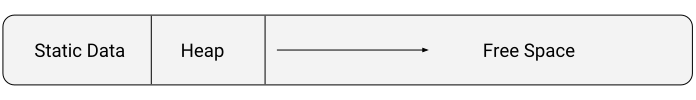

# Wasp 🐝
a Lisp programming language for extremely performant and concise web assembly modules

**warning:** this compiler is very alpha and error messages aren't the best, but it works and language is simple!

```clojure
; main.w
(extern console_log [message])
(pub defn main []
  (console_log "Hello World!"))
```

# Features
* [x] encourages immutability
* [x] immutable c-strings, memory manipulation, global variables, imported functions, 1st class functions
* [x] optional standard library runtime
* [x] functions with inline web assembly
* [x] test framework support
* [x] easy project dependency management
* [ ] self hosting
* [ ] code pruning and inlining
* [ ] type inference

# Quickstart

Wasp depends on `git` and `rust`. Make sure you have them installed before beginning.

```console
cargo install wasp
wasp init myproject
cd myproject
wasp build
python3 -m http.server
```
Open up http://localhost:8000 and look in console. At this point we will have a web assembly module that has access to the [standard libraries](https://github.com/wasplang/std) functions.  More to come in this area!

If you don't have need for the standard library (or want to write your own!). This is also an option.

```console
wasp init myproject --no-std
```

At this point we will have a web assembly module with a single exported main function and nothing else.

If you think your standard library is out of date, just run `wasp vendor`

# Lisp like its 1959

Wasp is an extremely basic language and standard library. It's primary goal right
now is to be a MINIMAL Lisp that can be self hosted. Specifically:
* emphasis on recursion
* functions can be passed around as arguments
* symbols
* immutable cons data structure

```clojure
(cons 42 nil) ; returns the memory location of cons
```
```clojure
(head (cons 42 nil) ; return the head value 42
```
```clojure
(tail (cons 42 nil) ; returns the memory location of tail
```

```clojure
(cons 1 (cons 2 (cons 3 nil)) ; returns a linked list
```

```clojure
(# cons 1 2 3) ; short hand for (cons 1 (cons 2 (cons 3 ())))
```

Other major features that are Lispy may be added in the future.

# Drawing

Using [wasm-module](https://github.com/richardanaya/wasm-module) we can easily draw something to screen. Loops in wasp work differently than other languages, bbserve how this example uses recursion to rebind variables.

```clojure
(extern global_getWindow [])
(extern Window_get_document [window])
(extern Document_querySelector [document query])
(extern HTMLCanvasElement_getContext [element context])
(extern CanvasRenderingContext2D_set_fillStyle [canvas color])
(extern CanvasRenderingContext2D_fillRect [canvas x y w h])

(def colors (data "black" "grey" "red"))

(pub defn main []
  (let [window (global_getWindow)
        document (Window_get_document window)
        canvas (Document_querySelector document "#screen")
        ctx (HTMLCanvasElement_getContext canvas "2d")]
        (loop [x 0]
               (if (< x 3)
                   (do (CanvasRenderingContext2D_set_fillStyle ctx (mem32 (+ colors (* 4 x))))
                       (CanvasRenderingContext2D_fillRect ctx (* x 10) (* x 10) 50 50 )
                       (recur [x (+ x 1)]))))))
```

See it working [here](https://wasplang.github.io/wasp/examples/canvas/index.html)

# Mutable Global Data

It's often important for a web assembly modules to have some sort of global data that can be changed.  For instance in a game we might have a high score.

```clojure
(def high_score (0) )

(defn run_my_game
  ...
  (mem32 high_score (+ (mem32 high_score) 100)  
  ...)
```

# Project Management
**warning: this may change but it works**
Code dependencies are kept in a special folder called `vendor` which is populated by specific checkouts of git repositories.

For example a `project.wasp` containing:

```
bar git@github.com:richardanaya/bar.git@specific-bar
```

would result in these commands (roughly)

```
rm -rf vendor
mkdir vendor
git clone git@github.com:richardanaya/bar.git@specific-bar vendor/bar
```

when `wasp vendor` is called

Now, when wasp compiles your code, it does a few things.

* In order specified by your `project.wasp`, one folder at a time all files ending in .w are loaded from each `vendor/<dependency-name>` and its subfolders.
* all files in the current directory and sub directories not in `vendor` are loaded
* then everything is compiled in order

Please try to use non conflicting names in meantime while this is fleshed out for 0.2.0

# Advanced
When necessary, low level web assembly can be directly inlined
```clojure
(defn-wasm memswap [i32] [i32] ; 1 input, 1 output
  [i32]  ; int tmp = 0;
  ; tmp = a
  LOCAL_GET   0
  LOCAL_SET   2
  ; a = b
  LOCAL_GET   1
  LOCAL_SET   0
  ; b = tmp
  LOCAL_GET   2
  LOCAL_SET   1
  END )

(pub defn main []
  ...
  (memswap 10, 20) )
```

# Technical Details
## Types
* **integer** - a 32-bit integer (e.g `-1`, `0`, `42`)
* **string** - a 32-bit pointer to a location in memory of the start of of a c-string (e.g. `"hello world!"`)
* **symbol** - a 32-bit pointer to a location in memory of the start of of a c-string (e.g. `":hello_world"`)
* **bool** - a 32-bit number representing boolean values. True is 1, false is 0. (e.g. `true` `false`)
* **(...)** - a global only type this is a a 32-bit pointer to sequence of 32-bit values in memory (e.g. `(another_global 1 true :hey (:more-data)`). Use this for embedding raw data into your application memory on startup.

## Functions
* **([pub] defn name ... )** - create a function that executes a list of expressions returning the result of the last one. Optionally provide an export name to make visible to host.
* **(function_name ...)** - call a function with arguments
* **(mem x:integer)** - get 8-bit value from memory location x
* **(mem x:integer y)** - set 8-bit value at memory location x to value y
* **(mem32 x:integer)** - get 32-bit value from memory location x
* **(mem32 x:integer y)** - set 32-bit value at memory location x to value y
* **(if x y)** - if x is true return expression y otherwise return ()
* **(if x y z)** - if x is true return expression y otherwise return expression z
* **(do ... )** - executes a list of expressions and returns the value of the last. useful putting complicated expressions in places that expect one expression.
* **(let [x0:identifier y0:expression x1:identifier y1:expression ... ] ... )** -  bind pairs of values to identifiers. Then run a sequence of expressions that can use those values by their identifier. Returns the value of the last expression in sequence. bindings specified in let shadow those at higher scopes.
* **(loop [x0:identifier y0:expression x1:identifier y1:expression ... ] ... x )** - bind pairs of values to identifiers. Then run a sequence of expressions that can use those values by their identifier. Returns the value of the last expression in sequence. bindings specified in loop shadow those at higher scopes.
* **(recur [x0:identifier y0:expression x1:identifier y1:expression ... ] ... x )** - rebinds pairs of values to identifiers and restarts the innermost loop.
* **(fnsig [x0 x1 .. ] y)** - gets the value of a function signature with inputs x0, x1, etc and output y
* **(call x f y0 y1 ...)** call a function with signature x and function handle f with parameters y0, y1, ...
* **(# function_name e1 e2 e3 ...)** recursively call a chain of functions (<fn> e1 (<fn> e2 (<fn> e3 ()))). I call this the nest operator. This function works differently the more parameters your fn takes.

### Common Operators
These oprators work pretty much how you'd expect if you've used C

* **(+ ...)** - sums a list of values and returns result
* **(- ...)** - subtracts a list of values and returns result
* **(\* ...)** - multiplies a list of values and returns result
* **(/ ...)** - divides a list of values and returns result
* **(% ...)** - modulos a list of values and returns result
* **(== x y)** - returns true if values are equal, false if otherwise
* **(!= x )** - returns true if values are not equal, false if otherwise
* **(< x y)** -  returns true if x is less than y, false if otherwise
* **(> x y)** - returns true if x is greater than y, false if otherwise
* **(<= x y)** - returns true if x is less than or equal y, false if otherwise
* **(>= x y)** - returns true if x is greater than or equal y, false if otherwise
* **(and x y)** - returns true if x and y are true, false if otherwise
* **(or x y)** - returns true if x or y are true, false if otherwise
* **(& x y)** - returns bitwise and of x and y
* **(| x y)** - returns bitwise or of x and y
* **(! x )** - returns true if zero and false if not zero
* **(^ x )** - bitwise exclusive or of x
* **(~ x )** - bitwise complement of x
* **(<< x y)** - shift x left by y bits
* **(>> x y)** - shift x right by y bits

## Testing
* **(deftest <test-name> x0 x1)** - executes expression x0 then x1 etc. and stops when it first encounters a value and return the value otherwise if all expressions return (), () is returned. Test names will be exported by default as `"test_"+name` when compiled in debug and removed when built with `wasp build --release`. The function `is` comes from the standard library.

```clojure
(deftest addition
  (is (= 4 (+ 2 2)) "2 + 2 should be 4")
  (is (= 7 (+ 3 4)) "3 + 4 should be 7"))
```

See it working [here](https://wasplang.github.io/wasp/examples/testing/index.html)

## Why so few functions?
Wasp prefers to keep as little in the core functionality as possible, letting the [standard library](https://github.com/wasplang/std) evolve faster and more independent community driven manner. This project currently follows a principle that if a feature can be implemented with our primitive functions, don't include it in the core compiled language and let the standard library implement it. Also that no heap based concepts be added to the core language.

## Notes
<p align="center">

</p>

* all functions (including extern functions) return a value, if no obvious return, it returns ()
* Web assembly global 0 is initialized to the end of the static data section (which might also be the start of a heap for a memory allocator). This value is immutable.
* Web assembly global lobal 1 also is initialized to the end of the static data section. This value is mutable and might be used to represent the end of your heap. Check out the [simple allocator example](https://github.com/richardanaya/wasp/blob/master/examples/malloc/main.w).
* Literal strings create initialize data of a c-string at the front of your memory, and can be passed around as pointers to the very start in memory to your text. A \0 is automatically added at compile time, letting you easily have a marker to denote the end of your text.
